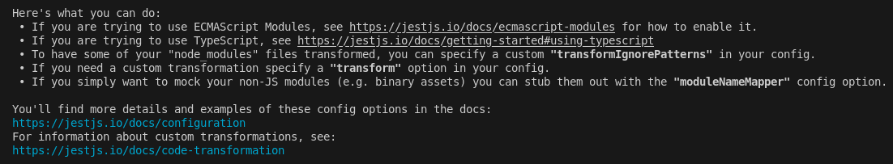
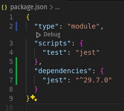
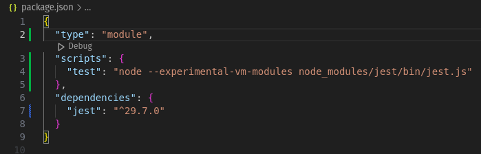

# Jest

Para correr los test de jest, ejecutar el siguiente comando:

```bash
npm run test
```

Para correr los test de jest con coverage  
1 - ir a package.json  
2 - en la seccion de scripts, modificar el comando test agregando la flag "--coverage"  
3 - ejecutar el siguiente comando:

```bash
npm run test
```

## Modulos
Como estamos usando ES6, para importar modulos, se debe usar la palabra reservada import. Jest soporta una versión experimental de ES6, por lo que al intentar ejecutar los tests simplemente con "jest", no va a funcionar. Para que funcione, se debe ejecutar el siguiente comando:

```bash
node --experimental-vm-modules node_modules/jest/bin/jest.js
```

Acá podemos ver el error que nos tira si intentamos correr los tests sin el flag experimental:



Y acá vemos el cambio que hicimos en el package.json para que funcione:





## Ejercicio

Completar los tests que faltan del archivo `advancedCalculator.js`, como también completar el codigo del mismo archivo para que los tests pasen. 